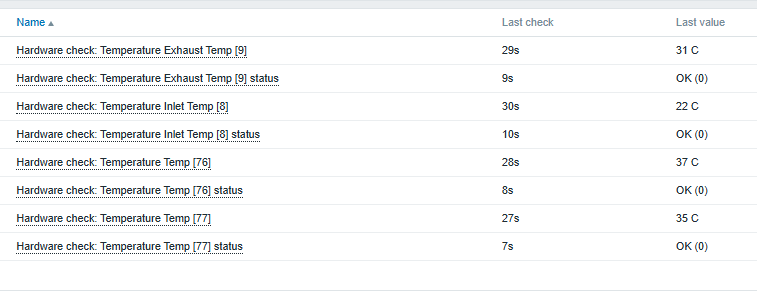
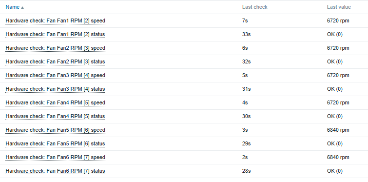
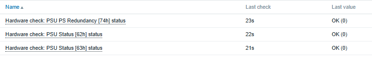
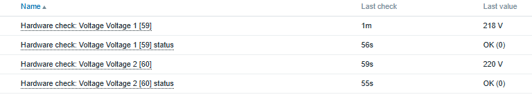
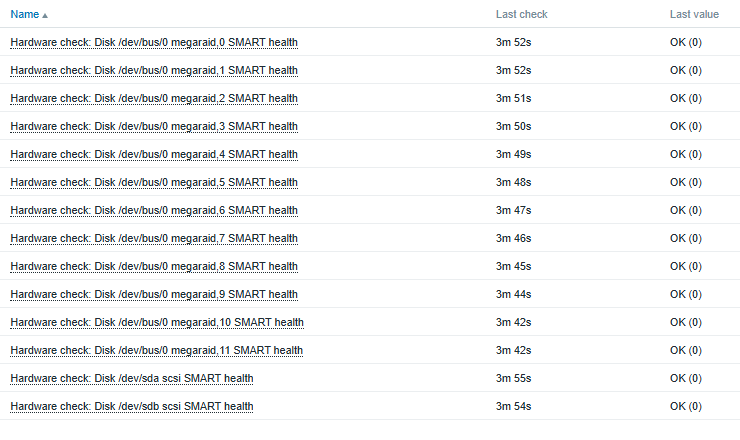
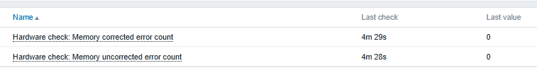
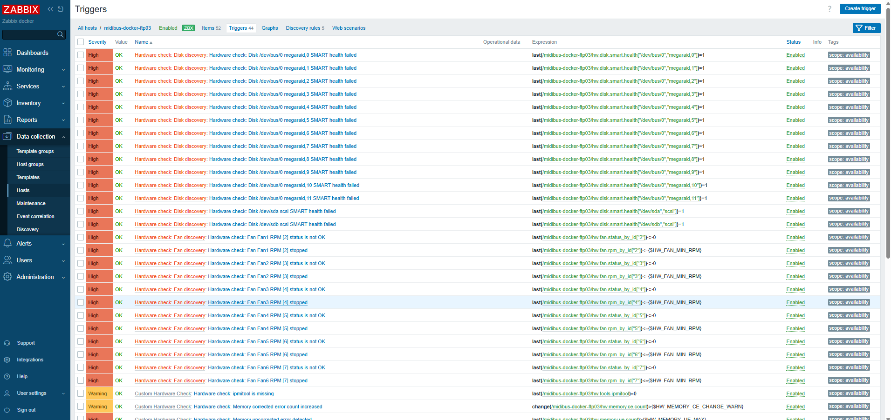
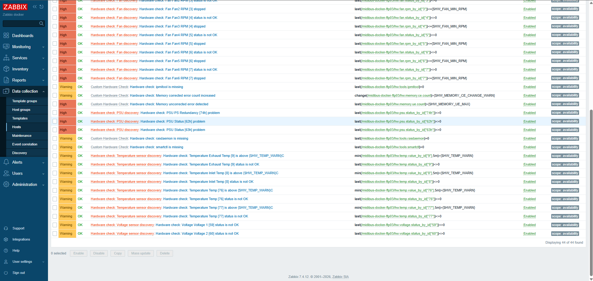

# Screenshot Collection

## 1. Temperature section

- Screen: Latest data with temperature filter applied
- Check points:
  - Temperature values are displayed in Celsius
  - Temperature status is shown as `OK (0)` etc.
  - Sensor ID tag is displayed

## 2. Fan section

- Screen: Latest data with fan filter applied
- Check points:
  - Fan RPM values are displayed
  - Fan status is shown
  - Verify that discrete sensors such as 'Fan Redundancy' do not enter the RPM item incorrectly

## 3. PSU section

- Screen: Latest data with PSU or power supply filter applied
- Check points:
  - PSU status is displayed
  - Normal status is represented as `OK (0)`

## 4. Voltage section

- Screen: Latest data with voltage filter applied
- Check points:
  - Actual voltage values are displayed in V units
  - Voltage status is shown
  - Verify that the Power Good/discrete sensor, such as 'VCORE PG', does not enter the voltage value item incorrectly

## 5. Disk SMART section

 
 
- Screen: Latest data with disk or SMART filter applied
- Check points:
  - Individual physical disks or RAID devices' SMART health is displayed
  - Normal status is represented as `OK (0)`
  - No duplicate or incorrectly detected disks

## 6. Memory section

 

- Screen: Latest data with memory filter applied
- Check points:
  - Memory corrected error count
  - Memory uncorrected error count
  - `rasdaemon availability`
- Note:
  - Collection behavior may vary depending on `rasdaemon` version or DB state

## 7. Trigger section

 

  
 
- Screen: Target Host's Triggers tab
- Check points:
  - ipmitool missing
  - smartctl missing
  - rasdaemon missing
  - PSU status != 0
  - SMART health = 1
  - Memory UE count > 0
  - Memory CE count increased
  - Temperature > threshold
  - Temperature status != 0
  - Fan RPM <= min rpm
  - Fan status != 0
  - Voltage status != 0